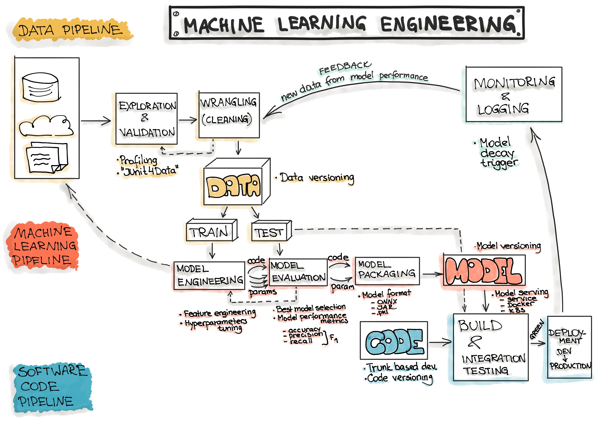

# MLflow Workshop for Cloudera Machine Learning

## Introduction

This repository provides a hands-on MLflow workshop tailored for Cloudera Machine Learning. The workshop is designed for data scientists looking to integrate MLflow into their MLOps workflows, covering key aspects such as experiment tracking, model versioning, deployment, and monitoring.

By the end of this workshop, participants will be able to:

- ✅ Track machine learning experiments with MLflow.
- ✅ Manage model versions and automate workflows using the Model Registry.
- ✅ Deploy models as endpoints and implement monitoring best practices.



## Workshop Structure

The workshop is divided into three labs:

1. **Experiment Tracking**: Learn how to use MLflow for tracking experiments, logging metrics, and comparing models.
2. **Model Registry and Deployments**: Understand how MLflow's Model Registry helps with managing and deploying models.
3. **Deployment and Monitoring**: Implement deployment and monitoring workflows using both technical and custom model metrics.

Each directory contains code examples, notebooks and optional exercises for diving deeper into the individual topics.

```text
.
├── README.md
├── lab_1_experiment_tracking
├── lab_2_model_registry
├── lab_3_monitoring
└── requirements.txt
```

## Prerequisites with Cloudera Machine Learning

| Component | Specification |
|-----------|---------------|
| Platform | Cloudera Machine Learning with running Workbench and Model Registry |
| Python Dependencies | See `requirements.txt` |
| MLflow | `2.19.0` (Provided by Cloudera Machine Learning Runtime) |
| Cloudera Machine Learning Workbench | >= `2.0.50-b52` |
| Cloudera Machine Learning Runtime | `ml-runtime-pbj-jupyterlab-python3.11-standard:2025.01.3-b8` |
| Public Internet Access | Not required* (PyTorch examples in Lab 1 require public internet access for loading example data. Please contact your platform team in case of issues.) |

## Getting Started

Each lab is self-contained with step-by-step instructions.
Follow the labs in order to get started with MLOps using MLflow and Cloudera Machine Learning. 🚀

1. Creata a new Cloudera Machine Learning Project based on this GitHub repository
2. Enable the Project Runtime `ml-runtime-pbj-jupyterlab-python3.11-standard:2025.01.3-b8`
3. Launch a session and install the dependencies `pip install -r requirements.txt`

> [!Note]
> If you want to run the [PyTorch example in Lab 1](./lab_1_experiment_tracking/README.md#good-example-2-using-mlflow-with-pytorch) you need to install the dependencies from requirements_torch.txt as well.

## Contact

- Cloudera Solutions Engineering : Maximilian Engelhardt <mengelhardt@cloudera.com>
