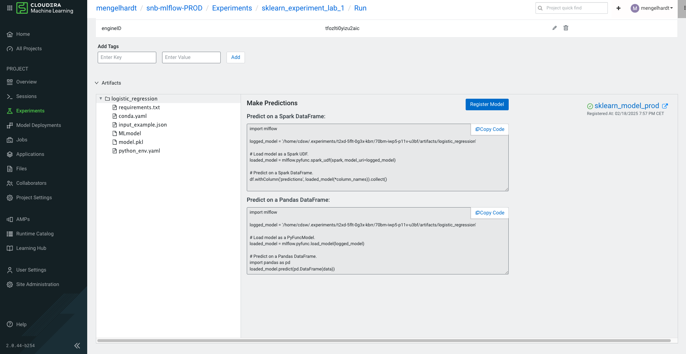
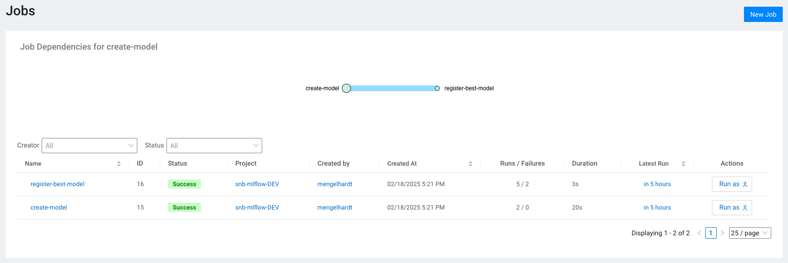

# Lab 2: Model Registry

## Introduction

In Lab 1 you learned how to track experiments with MLflow on Cloudera Machine Learning (CML). This lab will take you a step further: once you have multiple models and runs, how do you keep them organized, versioned, and easy to discover? Cloudera’s **Model Registry** solves this problem by acting as a centralized repository where you can register and track your models.

This lab will teach you how to register models, store them in the Model Registry, and manage different versions systematically—without overwriting or losing history.

## Overview

- [Lab 2: Model Registry](#lab-2-model-registry)
  - [Introduction](#introduction)
  - [Overview](#overview)
  - [Why Model Registry?](#why-model-registry)
  - [Good Example 1: Version and Manage your Models via Model Registry](#good-example-1-version-and-manage-your-models-via-model-registry)
  - [Good Example 2: Automation with Cloudera Machine Learning Jobs and Pipelines](#good-example-2-automation-with-cloudera-machine-learning-jobs-and-pipelines)
  - [Model Registry Features](#model-registry-features)
    - [Registering a model via the MLflow SDK](#registering-a-model-via-the-mlflow-sdk)
    - [Interacting with the Model Registry via the Cloudera API](#interacting-with-the-model-registry-via-the-cloudera-api)
    - [Model Deployments from the Model Registry](#model-deployments-from-the-model-registry)
    - [Cross Project Workflows: Example with Development and Production](#cross-project-workflows-example-with-development-and-production)
  - [Summary](#summary)


## Why Model Registry?

When collaborating on machine learning projects, it’s easy to lose track of which model is the “latest” or “best.” You might end up with:
- Multiple `model_v1.pkl`, `model_v2.pkl`, and `model_latest.pkl` files scattered in different folders.
- Little to no documentation on the differences between those files.

By using a **Model Registry**, you ensure:

- **Centralized Storage**: A single source of truth for all models in your project.  
- **Automatic Versioning**: Each new model or model update is assigned a unique version number.  
- **Traceability**: Every model can be linked back to the experiment run (metrics, hyperparameters, etc.) that produced it.

## Good Example 1: Version and Manage your Models via Model Registry

In this scenario, a model is trained and pushed the model to the registry manually through the Experiments User Interface.

1. Create an experiment, e.g. by running the Python script [`model_registry_create_model.py`](./model_registry_create_model.py)
2. Register the model via the Experiments UI:
- Navigate to your Workspaces or Projects and click on Experiments.
- Find the experiment you just created and select a speific run. You can see the parameters, metrics, and any artifacts.
- While viewing the specific run in the Experiment Interface, locate the option to Register the model.
- Provide a Model Name (e.g., sklearn_model), a brief description, and confirm your selection.
- Cloudera Machine Learning then creates a new entry in the Model Registry, associating it with this experiment run.



3. Browse Model Details via the Registry UI
- Go to the Model Registry tab in your Workspace (you may have to navigate to the `Home` page of the Workspace).
- Find and click on the newly created model. You can now see all its versions (including the one just registered), details like creation time, run ID, and any metadata logged by MLflow.
- Other team members can also view this registry entry, download artifacts, or further update the model version as needed.

## Good Example 2: Automation with Cloudera Machine Learning Jobs and Pipelines

These workflows can (and should, depending on the complexity of your use case) also be automated, e.g. using Cloudera Machine Learning Jobs and Pipelines.

Example workflow:
1. An initial Job creates experiments/runs and logs model artifacts, e.g. [`model_registry_create_model.py`](./model_registry_create_model.py).

```python
mlflow.set_experiment(EXPERIMENT_NAME)
with mlflow.start_run():
    ...
    mlflow.sklearn.log_model(model, MODEL_ARTIFACT_LOCATION, signature=signature, input_example=X_train[:1])
```

2. A subsequent Job retrieves the best performing model and pushes it to the registry, e.g. [`model_registry_push_to_registry.py`](./model_registry_push_to_registry.py).

```python
mlflow.set_experiment(EXPERIMENT_NAME)

run_results = mlflow.search_runs(search_all_experiments=True)
best_run_id = run_results.loc[run_results["metrics.accuracy"].idxmax(), "run_id"]
registered_model = mlflow.register_model(f"runs:/{best_run_id}/{MODEL_ARTIFACT_LOCATION}", "sklearn_model")
```



- Cloudera Documentation for Jobs and Pipelines: https://docs.cloudera.com/machine-learning/1.5.3/jobs-pipelines/topics/ml-creating-a-job-c.html

## Model Registry Features

Cloudera Machine Learning supports the different features and ways to interact with the Model Registry.

### Registering a model via the MLflow SDK

- Example for registering a model via the `mlflow.log_model` API, note that this will also create a new experiment (or run, if an experiment witht the same name already exists):

```python
mlflow.sklearn.log_model(model, "sklearn_model", registered_model_name="sklearn_model")
```

- Example for registering a model via the `mlflow.register_model` API, note that this will **not** create an experiment:

```python
registered_model = mlflow.register_model(f"runs:/{best_run_id}/{model_artifact_location}", "sklearn_model")
```

### Interacting with the Model Registry via the Cloudera API

- Cloudera API enables automation and more complex MLOps workflows.
- Some Model Registry APIs may be available only from Data Services >= 1.5.4
- API Reference: https://docs.cloudera.com/machine-learning/1.5.3/api/topics/ml-api-v2.html

- Example for registering a model:

```python
import cmlapi
import os

workspace_domain = os.getenv("CDSW_DOMAIN")
client = cmlapi.default_client(url=f"https://{workspace_domain}")

CreateRegisteredModelRequest = {
    "project_id": "<project-id>", 
    "experiment_id" : "<experiment-id>",
    "run_id": "<run-id>", 
    "model_name": "<model-name>", 
    "model_path": "<model-artifact-uri>", 
    "visibility": "PUBLIC"
}

api_response = client.create_registered_model(CreateRegisteredModelRequest)
```

- Example for retrieving metadata from a registered model

```python
import os
import json
import cmlapi

# Set up client
workspace_domain = os.getenv("CDSW_DOMAIN")
client = cmlapi.default_client(url=f"https://{workspace_domain}")

# Retrieve model ID by model name
search_filter = {"model_name": "sklearn_model"}
response_dict = client.list_registered_models(search_filter=json.dumps(search_filter)).to_dict()
model_id = response_dict["models"][0]["model_id"]
print(f"Model ID: {model_id}")

# Retrieve details for the latest model version
model_details = client.get_registered_model(model_id).to_dict()
latest_version = model_details["model_versions"][0]
print(f"Latest Model Version: {latest_version}")

# Extract experiment ID and run ID from the latest model version
mlflow_meta = latest_version["model_version_metadata"]["mlflow_metadata"]
experiment_id = mlflow_meta["experiment_id"]
history_tag = next(
    tag["value"]
    for tag in mlflow_meta["tags"]
    if tag["key"] == "mlflow.log-model.history"
)
run_id = json.loads(history_tag)[0]["run_id"]

print(f"Experiment ID: {experiment_id}")
print(f"Run ID: {run_id}")
```

### Model Deployments from the Model Registry

The Model Registry is naturally complemented by Model Deployments, which allow registered models to be served as APIs for real-time inference or batch processing. Once a model is stored in the registry, it can be deployed in Cloudera Machine Learning (CML) either via the User Interface (UI) or programmatically using the Cloudera API/SDK.

- Deploying a Model via the Cloudera User Interface: Refer to the Cloudera Documentation: https://docs.cloudera.com/machine-learning/1.5.3/models/topics/ml-deploying-model-from-model-registry-page.html

- Example via the Cloudera API:

```python
import cmlapi
import os

workspace_domain = os.getenv("CDSW_DOMAIN")
client = cmlapi.default_client(url=f"https://{workspace_domain}")

CreateModelRequest = {
    "project_id": PROD_PROJECT_ID, 
    "name" : MODEL_NAME,
    "description": DESCRIPTION, 
    "disable_authentication": True,
    "registered_model_id": REGISTERED_MODEL_ID
}

api_response = client.create_model(CreateModelRequest, PROD_PROJECT_ID)
```

### Cross Project Workflows: Example with Development and Production

Separating development (DEV) and production (PROD) projects in Cloudera Machine Learning follows best practices for environment isolation, reproducibility, and governance.

Good Practice: Cross-Project Workflow
1. Train in DEV: Train a model in a “DEV” project, log experiment runs, and push the final model to the Model Registry.
2. Deploy in PROD: In the “PROD” project, retrieve the registered model via the Cloudera APIs and deploy it, ensuring no manual file transfers or inconsistencies.

Why This is Beneficial:
- ✅ Environment Isolation: Prevents untested models from being deployed in production.
- ✅ Reproducibility & Governance: Models deployed in PROD are always retrieved from the registry, maintaining a controlled and traceable pipeline.
- ✅ Automation & CI/CD Compatibility: Enables API-based deployments, reducing human error and ensuring consistency between environments.

## Summary

A Model Registry is essential once you move beyond a few simple experiments. By registering each model:
- You maintain a unified repository where all contributors can find and compare models.
- Version confusion is reduced, as each new iteration is automatically versioned.
- It’s easy to trace each model back to the run that produced it, ensuring reproducibility.

You’ve now seen how to register models using both the Cloudera Machine Learning User Interface and programmatically with either the Cloudera API or MLflow’s SDK. In Lab 3, we’ll focus on deployment and monitoring scenarios in an end-to-end example.
