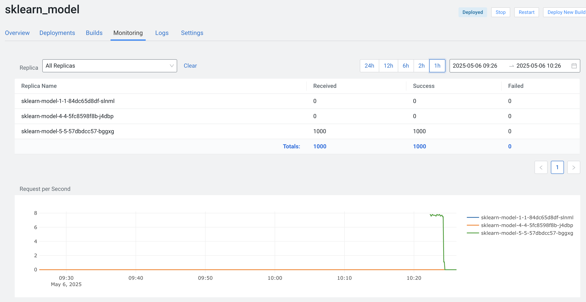

# Lab 3: Deployment and Monitoring Workflows

## Introduction

Labs 1 and 2 have already covered Experiment Tracking, Model Registry and Model Deployments. This lab adds the critical last step in the MLOps pipeline: **Monitoring**.

    experiments → model registry → deployment → monitoring

> [!Tip] Once a model is in production, continuous monitoring is crucial to ensure:
>
> - ✅ Infrastructure scales effectively (low latency, stable request handling).
> - ✅ Performance remains high (accuracy, prediction quality).
> - ✅ Model drift and data shifts are detected early to prevent degradation.

## Overview

- [Lab 3: Deployment and Monitoring Workflows](#lab-3-deployment-and-monitoring-workflows)
  - [Introduction](#introduction)
  - [Overview](#overview)
  - [Why Monitoring?](#why-monitoring)
  - [Best Practice #1: Technical Monitoring](#best-practice-1-technical-monitoring)
  - [Best Practice #2: Prediction Monitoring with Model Metrics](#best-practice-2-prediction-monitoring-with-model-metrics)
    - [Track Predictions and Custom Metrics Locally](#track-predictions-and-custom-metrics-locally)
    - [Use Model Metrics to Monitor Drift for a Deployed Model](#use-model-metrics-to-monitor-drift-for-a-deployed-model)
  - [Summary](#summary)

## Why Monitoring?

Monitoring is essential for maintaining model performance and reliability in production. Without it, models can degrade silently, leading to poor predictions. Key challenges include tracking accuracy, detecting drift, and ensuring scalability. Effective monitoring provides visibility into model behavior and enables proactive maintenance.

## Best Practice #1: Technical Monitoring

Technical monitoring focuses on the operational health of deployed models, especially those running as REST API endpoints. By tracking metrics like request rates, failures, response times, CPU, and memory usage, you can quickly identify and resolve infrastructure issues before they impact users.

Using the model deployed in the previous lab, the notebook [1_technical_metrics_create_traffic.ipynb](./1_technical_metrics_create_traffic.ipynb) demonstrates how to simulate load and monitor these metrics in practice.

```python
from cml.models_v1 import call_model

for sample in synthetic_sample:
    input_sample = {"inputs": [sample.tolist()]}
    call_model(model_access_key=MODEL_ACCESS_KEY, ipt=input_sample)
```

After a few minutes, the Model Deployment Monitoring UI should show the load.



Documentation: <https://docs.cloudera.com/machine-learning/cloud/models/topics/ml-model-tech-metrics.html>

## Best Practice #2: Prediction Monitoring with Model Metrics

To answer questions such as data & concept drift and to add custom business logic to monitoring workflows, Model Metrics offer a customizable approach to monitor both REST API endpoints and batch inference processes. By integrating custom code, users can track specific performance indicators tailored to their models.

### Track Predictions and Custom Metrics Locally

As long as Model Metrics are enabled for the Machine Learning Workbench, Cloudera deploys an embedded Postgres Database to store Model Metrics related data. See also <https://docs.cloudera.com/machine-learning/cloud/models/topics/ml-enabling-model-metrics.html>. To make use of the metrics store, decorate your prediction function with the Cloudera Model Metrics decorator.

>[!Note] Model Metrics with Deployments from Registry
>
> With the current Workbench version `2.0.50-b52`, model deployments from registry are always done with an (auto-generated) decorated predict_with_metrics function. This allows any direct deployments from the registry to be used with the Model Metrics feature, unless the Workbench has Model Metrics feature disabled.

The notebook [2a_predict_with_metrics_locally.ipynb](2a_predict_with_metrics_locally.ipynb) shows a full example how to set up a decorated prediction function and test it locally, based on the example model from the previous labs:

```python
import cml.metrics_v1 as metrics
import cml.models_v1 as models

...
# Load the model from mlflow
model = mlflow.pyfunc.load_model(...)

# Set up model metrics with decorator
@models.cml_model(metrics=True)
def predict(args):
    metrics.track_metric("input", args) # Track the input with every inference
    result = model.predict(args)
    metrics.track_metric("output",result) # Track the output with every inference
    return result
```

The predictions and metrics defined via  `metrics.track_metrics(...)` are now logged to the Metrics Store along with metadata `model_deployment_crn` and `uuid` that can later be used to retrieve and analyse the tracked data:

```python
...
# invoke the decorated predict function
prediction = predict(example_input)
print(prediction)

>>> {'prediction': array([0]),
 'model_deployment_crn': 'crn:cdp:ml:::workspace:dev/model-deployment',
 'uuid': '5f94cb41-eb5b-4b8b-a750-67874f7d4aad'}
```

### Use Model Metrics to Monitor Drift for a Deployed Model

The notebook [2b_use_model_metrics_online.ipynb](2b_use_model_metrics_online.ipynb) shows a full example how to make use of Model Metrics to monitor prediction quality and data drift. This is done by tracking inputs, predictions and a delayed ground truth. The ground truth is often available after predictions are made and served to end users/applications.

```
Step 1: Model makes a prediction
- Input data comes in
- Model makes a prediction
- System records this with a unique ID (UUID)

Step 2: Later, when you know the actual answer
- You can look up the original prediction using the timestamp
- You can then compare the prediction with the actual answer
- This helps you track if the model is drifting (making worse predictions)
```

> [!Tip] Understanding Drift Monitoring
>
> Drift monitoring helps you detect when your model's performance starts to degrade. There are two main types of drift:
>
> **Data Drift**: When the distribution of input data changes over time
>   - Example: If your model was trained on data from 2020, but now receives data from 2024
>   - This can happen due to changing user behavior, market conditions, or other external factors
>
> **Concept Drift**: When the relationship between inputs and outputs changes
>   - Example: A model predicting customer churn might need to adapt to new customer behavior patterns
>   - This can happen when the underlying patterns in your data change

## Summary

Monitoring is a critical component of the MLOps pipeline that ensures models remain reliable and performant in production. This lab covered two key aspects of monitoring:

- Technical monitoring for infrastructure health and performance
- Prediction monitoring with model metrics for tracking model quality and drift
